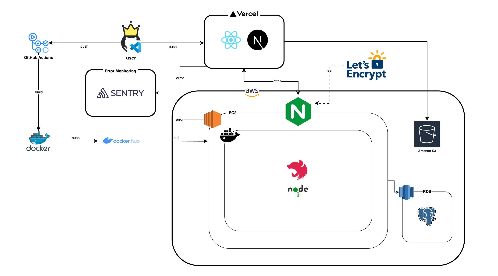

# 📦 무빙 (Moving) - Backend

이사 전문가 매칭 서비스 무빙의 백엔드 API 서버입니다. NestJS 프레임워크를 기반으로 개발되었으며, 고객과 이사 기사를 연결하는 플랫폼 서비스를 제공합니다.

## 프로젝트 개요

무빙은 이사 서비스를 필요로 하는 고객과 이사 전문가 기사님을 매칭하는 서비스입니다. 고객은 견적을 요청하고, 기사는 견적을 제안하며, 상호 평가를 통해 신뢰성 있는 이사 서비스를 제공합니다.

## 프로젝트 기간

2025.5.15 ~ 2025.06.27

## 링크

- [무빙 서비스 바로가기](https://5-moving.vercel.app/)
- [API 문서 바로가기](https://hay-oon.com/api-docs)
- [팀 노션 바로가기](https://positive-kingfisher-003.notion.site/1-_-1f0d9fa672ba8055b067ec2833354efd?source=copy_link)

## 🛠 기술 스택 (Tech Stack)

### ✅ 백엔드 (Backend)


### 🗄️ 데이터베이스 (Database)


### 🔐 인증 및 스토리지 (Authentication & File Storage)


### 🧪 테스트 (Testing)


### ⚙️ 패키지 매니저 (Package Manager)


### 🧾 검증 및 API 문서화 (Validation & API Docs)


### 🚀 배포 (Deployment)


---

## 📦 전체 기술 개요 (Full Stack Overview)

- **프레임워크 (Framework)**: NestJS  
- **언어 (Language)**: TypeScript  
- **데이터베이스 (Database)**: PostgreSQL + TypeORM  
- **인증 (Authentication)**: JWT, Passport (Local, Google, Kakao, Naver)  
- **파일 스토리지 (File Storage)**: AWS S3  
- **패키지 매니저 (Package Manager)**: pnpm  
- **테스트 (Testing)**: Jest  

### 🧰 개발 도구 (Development Tools)

- **ESLint**: 코드 품질 관리 (Code Quality Enforcement)  
- **Prettier**: 코드 포맷팅 (Code Formatting)  
- **TypeScript**: 타입 안정성 확보 (Static Typing for Safety)

### 📑 API 및 검증 (API & Validation)

- **Zod**: 런타임 스키마 검증 (Runtime Schema Validation)  
- **Swagger**: 자동 API 문서 생성 (Auto-generated API Docs)

### 🔔 기타 기능 (Other Features)

- **Server-Sent Events (SSE)** 기반의 알림 시스템


## 프로젝트 구조

```
src/
├── auth/                 # 인증 및 인가
├── user/                # 사용자 공통 기능
├── customer-profile/    # 고객 프로필 관리
├── mover-profile/       # 기사 프로필 관리
├── estimate-request/    # 견적 요청 관리
├── estimate-offer/      # 견적 제안 관리
├── like/               # 찜 기능
├── review/             # 리뷰 시스템
├── notification/       # 알림 시스템
├── s3/                 # 파일 업로드
├── database/           # 데이터베이스 설정
├── scheduler/          # 스케줄러
└── common/             # 공통 유틸리티
```

## 데이터베이스 ERD


## 아키텍쳐



## 팀원별 담당 기능

### [정하윤](https://github.com/hay-oon)

**DB 설계 & 기사님 견적 관리 관련 CRUD 담당**

- 데이터 모델링 및 API 명세 작성
- `POST /api/s3/presigned-url` - S3 Presigned URL 요청
- `GET /api/estimate-offer/:offers` - 견적 제안 목록 조회
- `GET /api/estimate-offer/:offerId` - 견적 제안 상세 조회
- `GET /api/estimate-offer/rejected-offers` - 반려한 견적 목록 조회
- `POST /api/estimate-offer/:requestId` - 견적 보내기
- `PATCH /api/estimate-offer/:requestId/rejected` - 견적 반려하기
- AWS 배포 아키텍쳐 구현 및 Github Actions CI/CD 파이프라인 구축

### [최은비](https://github.com/silverraining)

**DB 설계 & 인증, 고객 견적 요청 및 견적 수신 흐름 전반 CRUD 담당**

- 사용자 인증 관련 API 구현
  - `POST /api/auth/register` – 로컬 회원가입
  - `POST /api/auth/login` – 로그인
  - `POST /api/auth/token/access` – 액세스 토큰 재발급
  - `POST /api/auth/logout` – 로그아웃
  - `PATCH /api/auth/me` – 회원 정보 수정
  - `GET /api/auth/login/:social?state=${role}` – 소셜 회원가입 (Google, Kakao)

- 고객 견적 요청 관련 API
  - `POST /api/estimate-request` – 견적 요청 생성 (고객)
  - `GET /api/estimate-request/history` – 과거 견적 요청과 받았던 견적 목록 조회 
  - `PATCH /api/estimate-request/:requestId/targeted` – 지정 기사 견적 요청
  - `PATCH /api/estimate-request/:requestId/cancel` – 견적 요청 취소 
  - `PATCH /api/estimate-request/:requestId/complete` – 이사 완료 처리 

- 고객의 견적 수신 및 조회 API
  - `GET /api/estimate-offer/:requestId/pending` – 고객이 받은 견적 제안 목록 조회 
  - `GET /api/estimate-offer/:requestId/:moverId/pending` – 고객이 특정 기사의 견적 제안 상세 조회

- 기사 기준 고객이 생성한 견적 요청 수신 API
  - `GET /api/estimate-request` – 기사가 받은 견적 요청 목록 조회


### [민지영](https://github.com/Obsessive-Curiosity)

**DB 설계 & 고객 및 기사 프로필 관리, 찜하기, 리뷰 관련 CRUD 담당**

- 인증 관련 API 
  - `POST /api/auth/register` – 로컬 회원가입  
  - `POST /api/auth/login` – 로그인  
  - `POST /api/auth/token/access` – 액세스토큰 재발급
  - `GET /api/auth/login/:social?state=${role}` – 소셜 회원가입 (Naver)
  
- 고객 프로필 관련 API
  - `POST /api/customer` – 고객 프로필 등록
  - `GET /api/customer/me` – 고객 본인 프로필 조회
  - `PATCH /api/customer/me` – 고객 본인 프로필 수정

- 기사 프로필 관련 API
  - `POST /api/mover` – 기사 프로필 등록
  - `GET /api/mover/:id` – 기사 상세 페이지 조회
  - `POST /api/mover/search` – 기사 목록 조회
  - `GET /api/mover/me` – 기사 본인 프로필 조회
  - `PATCH /api/mover/me` – 기사 본인 프로필 수정
 
- 기사 찜하기 기능 
  - `POST /api/like` – 기사 찜하기  
  - `DELETE /api/like/:moverId` – 기사 찜하기 취소  
  - `GET /api/like/mover` – 찜한 기사 목록 조회  

- 리뷰 관련 API 
  - `POST /api/review/:reviewableOfferId` – 리뷰 작성  
  - `GET /api/review/available` – 리뷰 작성 가능한 견적 조회  
  - `GET /api/review/customer/me` – 고객(작성한) 리뷰 조회  
  - `GET /api/review/mover/me` – 기사(받은) 리뷰 조회  
  - `GET /api/review/mover/:id` – 해당 기사(받은) 리뷰 조회  

- 견적 제안 확인 및 확정 API
  - `PATCH /api/estimate-offer/:offerId/confirmed` – 기사의 제안 견적 확정 (고객)

### [김조순](https://github.com/josunkim)

**알림 관련 CRUD 담당**

- `POST /api/notifications` - 알림 생성 (이벤트 리스너/Cron을 사용하여 일정 이벤트 및 시간이 되면 알림 자동생성 )
- `GET /api/notifications` - 유저의 알림 중 읽지않은 알림을 전체 조회
- `PATCH /api/notifications/read` - 알림 읽음처리
- `GET /api/notifications/stream` - 알림 SSE연결 (신규 알림이 생성되면 Client에 전송)


## 주요 기능

### 인증 시스템

- JWT 기반 인증
- 소셜 로그인 (Google, Kakao, Naver)
- 역할 기반 접근 제어 (고객/기사)

### 견적 시스템

- 고객의 견적 요청
- 기사의 견적 제안
- 견적 상태 관리 (대기/확정/거절)

### 프로필 관리

- 고객/기사 프로필 등록 및 수정
- 기사 검색 및 필터링
- 프로필 이미지 업로드

### 평가 시스템

- 서비스 완료 후 상호 리뷰
- 별점 및 텍스트 리뷰
- 기사 평점 관리

### 부가 기능

- 기사 찜하기
- 실시간 알림
- 파일 업로드 (AWS S3)
